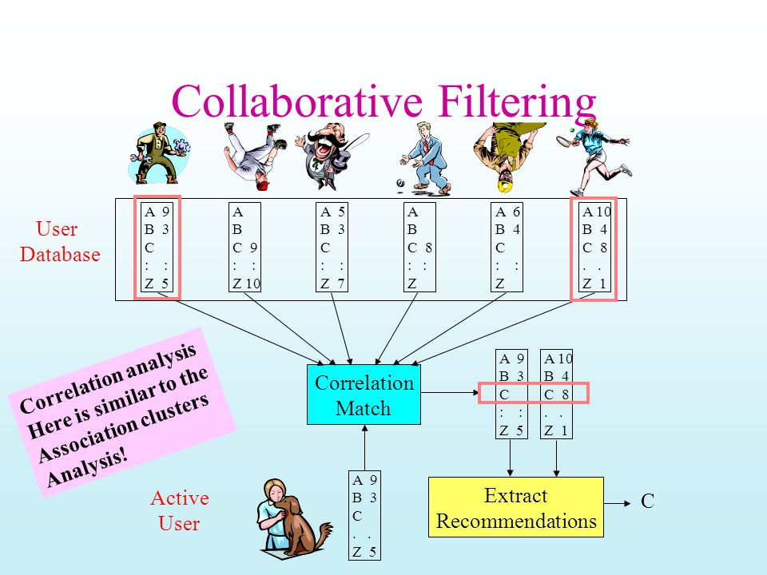

# Building a recommendation engine using collaborative filtering.

Most websites like Amazon, YouTube, and Netflix use collaborative filtering as a part of their sophisticated recommendation systems.
Collaborative filtering works by **searching a large group of people and finding a smaller set of users with tastes similar to a particular user. It looks at the items which smaller set of users like and combines them to create a ranked list of suggestions.**

Primarily , there are two steps involved in Collaborative Filtering. These are as follows :-

**1. Find similar users or items to the concerned user/item.**

**2. Predict the ratings of the items that are not yet rated by a user.**

Things one will learn by going through the notebook are :-

- **Intuition behind the collaborative filtering based recommendation system**.

- Implementation of the same using **Memory and Method based approach** leveraging scikit-surprise library in Python.

- Difference between **user based and item based** collaborative filtering. 

- Different **types of similarity metrics** such as euclidean distance , cosine similarity etc.

References :  https://realpython.com/build-recommendation-engine-collaborative-filtering/
